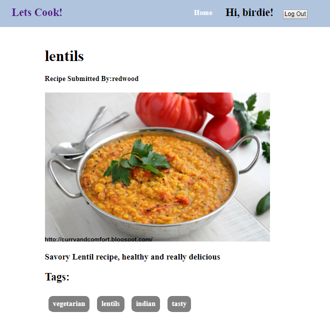
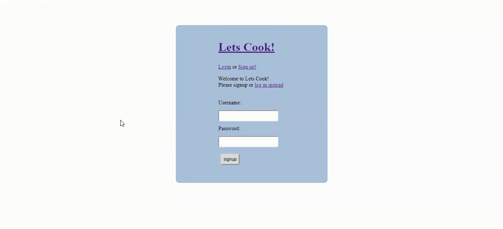

# Let's Cook






[Video Demonstration](https://m.youtube.com/watch?v=OS68yoqpwU4)

## What the app does

  Let's Cook! is a recipe sharing application where users can upload recipes for others to view.
  Users can edit, delete, add ingredients, directions, comments and likes to a recipe.
  Users can only edit a recipe that she or he has uploaded themselves. Users can view all the recipes
  submitted to Let's Eat in one navigation link and see all of thier own recipes in another
  navigation link. Users can also create a new account to login and logout.

  Let's Eat! is a web application made with Ruby, Ruby on Rails, React and Redux. Jbuilder is also used to 
  customize the JSON recipe response. The backend is made with Ruby and Ruby on Rails. The front end is made
  with React and Redux.


## Reduced the Number of Action Creators for Recipe Detail Component
  
  In the Recipe detail component, I had originally got that component to work by making 3 or 4 different action creator fetches 
  to fetch the Recipe data, another fetch for directions, another for ingredients, comments.. then I realized that I was making all
  these extra calls to the database when I could just use jBuilder to fetch all the associated directions, ingredients, comments, likes in a single fetch for
  a single recipe. 

  I had all these extra reducers that weren't needed and was able to speed up my application a little bit by reducing the number of action creators
  to the database, to just a single action creator. Also an issue I encountered was on submitting a new recipe, the recipe url would go to the new api/recipes/:recipeId
  page, yet it wouldn't render. Once I reduced the number of action creators as well as transferring that recipe data into the Recipe Detail Component's own state, it would
  immediately render the new recipe title, description etc.

## Restricting Access to Edit a Recipe

  I had wanted to make the Recipes have the ability to be editted if the user logged in was the user that created that particular recipe. Originally I was pulling
  the userId and the username from the the session piece of state. Yet, in this manner the user information would only show up immediately after logging into the 
  application and then subsequent refreshes of the page, the user information would disappear. This affected the ability for the page to be able to be editted even
  if the user was logged in. Eventually I pulled the user information from the users piece of state and was able to continually have the user information be accurate
  and available and was able to ensure that the logged in user could edit thier own recipes. I made the respective ingredients, directions and general recipe information
  render the extra forms to edit available if the username was the same as the recipe's author and if they were not the same the forms didn't show up.

```
  componentDidMount() {

    this.props.requestSingleRecipe(this.props.match.params.recipeId)
    .then(res => this.setState({ 'recipe': res }));
  }

```

  The code is from the Recipe Detail Component and simplifed the number of calls in ComponentDidMount and ComponentDidUpdate.


## Future Directions for the Project

  - Ability to filter by recipe popularity and recipes that are currently in season.

  - Have a featured recipe's section based on popularity and based on what recipes the particular user has many page views for.

  - Ability to favorite a recipe and pull up a tab with all thier favorited recipes which they can add or remove favorited recipes.
